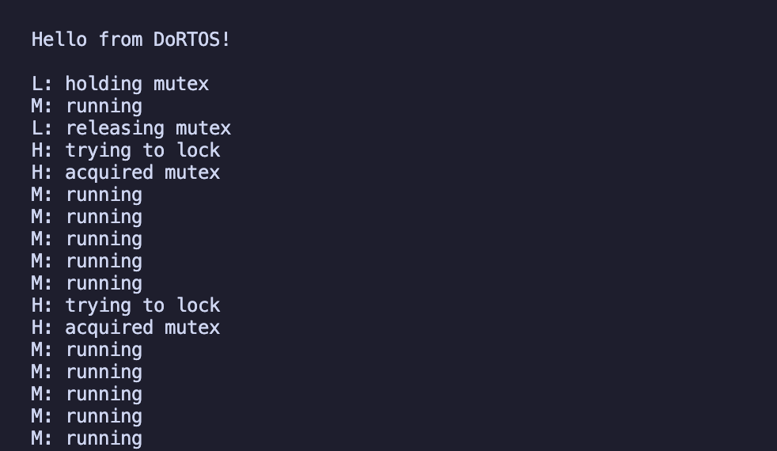

<div align="center">

  # DoRTOS
  

</div>

<div align="center">

### <sub>Tiny RTOS</sub> for ARM Cortex-M3 (lm3s6965evb) Machine 
[]()

</div>
 
## Table of Contents
 
- [Overview](#overview)
- [Features](#features)
- [Requirements](#requirements)
- [Building](#building)
- [Resources](#resources)
 
## Overview
 
DoRTOS is a tiny preemptive Real-Time Operating System written from scratch in C and ARM Thumb-2 assembly, targeting the ARM Cortex-M3 processor. It runs on the `lm3s6965evb` machine emulated by QEMU.

## Features
 
- UART driver (PL011)
- 1ms tick period using the Cortex-M3 SysTick peripheral
- Task Control Blocks (TCBs) with statically allocated 256-word (1KB) stacks per task
- Context switch implemented in ARM Thumb-2 assembly (`PendSV_Handler.s`), saving and restoring `r4–r11` manually alongside the hardware-saved frame
- `scheduler_next` performs a full scan of the task table each tick, selecting the highest-priority READY task (round-robin tiebreaker for tasks of equal priority)
- Binary mutex with FIFO wait queue for blocked tasks
- `mutex_lock` blocks the calling task and immediately elevates the mutex holder's `effective_priority` to the waiter's level if the waiter has higher priority, preventing priority inversion
- Fixed-size pool allocator for dynamic TCB allocation at runtime

## Requirements
 
- macOS on Apple Silicon (tested on MacBook Pro M4)
- `arm-none-eabi-gcc` 
- `qemu-system-arm` (10.1.3)
- `make` 

## Building
 
### Build and run
 
```bash
make clean && make run
```

### Expected terminal output


 
With the priority inheritance demo in `main.c` (task_low priority 1, task_med priority 2, task_high priority 3), you should observe:
 
- Task L acquires the mutex and holds it
- Task H wakes and tries to lock, blocks, elevating Task L's priority to 3
- Task M (priority 2) is preempted because Task L now runs at priority 3
- Task L releases the mutex promptly, Task H acquires it
- Task L's priority drops back to 1, Task M resumes normal scheduling

## Resources

- [ARM Cortex-M3 Technical Reference Manual](https://www.keil.com/dd/docs/datashts/arm/cortex_m3/r2p0/ddi0337g_cortex_m3_r2p0_trm.pdf)
- [ARM PrimeCell UART (PL011) Technical Reference Manual](https://www.taylortjohnson.com/class/cse2312/f14/uart_manual.pdf)
- [Stellaris LM3S6965 Datasheet](https://www.keil.com/dd/docs/datashts/luminary/lm3s6965.pdf)
- [The Definitive Guide to ARM Cortex-M3 — Joseph Yiu](https://wiki.ifsc.edu.br/mediawiki/images/2/29/MIPM3TUG.pdf)
- [QEMU lm3s6965evb machine documentation](https://www.qemu.org/docs/master/system/arm/stellaris.html)

## License

This project is licensed under the Apache License 2.0. See the [LICENSE](./LICENSE) file for details.
